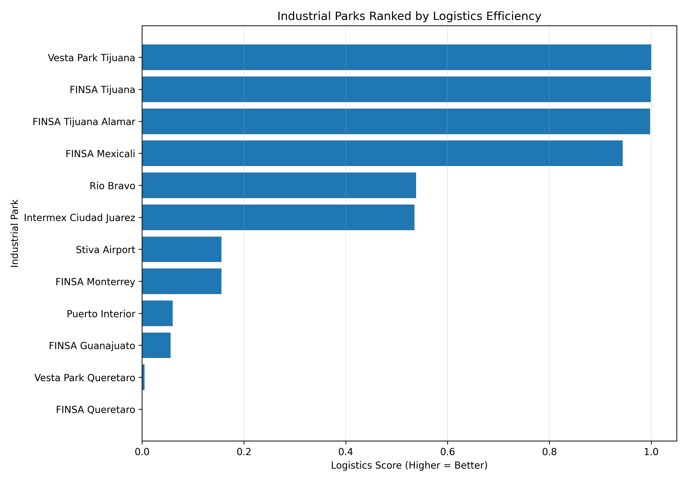

# mexico-industrial-zones-logistics

This repository contains replication and analysis code for **"Industrial Park Location and Logistics Access in Mexico."**

The project constructs a cross-sectional dataset of selected Mexican industrial parks and evaluates their proximity to two key logistics nodes:
- The United States border  
- The Port of Ensenada  

Using geodesic distances, the analysis builds a normalized **logistics efficiency score** to compare locations.

---

## Main Result



---

## Methodology

Distances are computed using great-circle (geodesic) distance between each industrial park and:

- U.S. border crossing (Tijuana / San Ysidro)
- Port of Ensenada

Distances are normalized using min–max scaling and combined into a composite score:

\[
\text{Score}_i = 0.7(1 - \tilde{d}_{iB}) + 0.3(1 - \tilde{d}_{iP})
\]

where:
- \( \tilde{d}_{iB} \): normalized distance to U.S. border  
- \( \tilde{d}_{iP} \): normalized distance to port  

Higher values indicate stronger combined logistics access.

---

## Data

The dataset (`data/zones.csv`) contains:

- Industrial park name  
- City and state  
- Geographic coordinates (latitude, longitude)  

Locations were manually geocoded using publicly available sources.

---

## Outputs

The analysis generates:

- `outputs/logistics_ranking.csv` — ranked industrial parks  
- `outputs/descriptive_table.csv` — cleaned dataset with distances  
- `outputs/summary_distances.csv` — summary statistics  
- `outputs/logistics_score_bar.png` — visualization of rankings  

---

## Key Findings

- Border regions (Tijuana, Mexicali) exhibit the highest logistics efficiency  
- Mid-range locations (Ciudad Juárez, Monterrey) balance multiple access points  
- Interior regions (Querétaro, Guanajuato) rank lower due to distance from export nodes  

---

## Usage

Install dependencies:

```bash
pip install pandas geopy matplotlib
